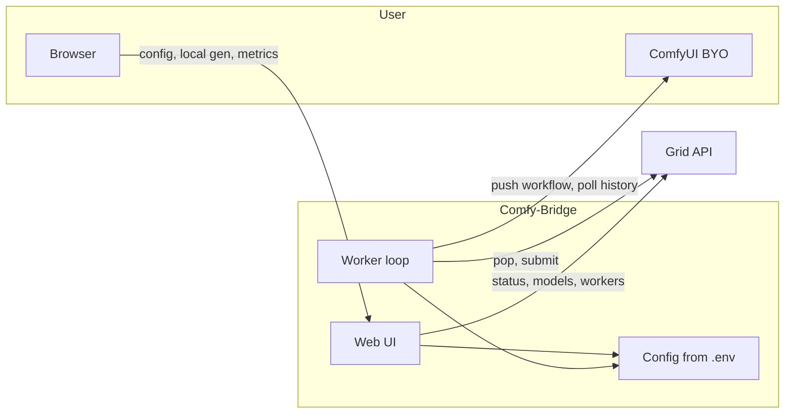

# Comfy-Bridge: Easy Install, GUI Config, Local Generations, and Grid Metrics

## Bring your own ComfyUI

- **No ComfyUI bundling or management.** The bridge never installs or starts ComfyUI.
- User runs ComfyUI separately (local or remote). Bridge only needs **COMFYUI_URL** (e.g. `http://127.0.0.1:8188`) to send workflows and poll history.
- Installer and GUI only set up and configure the **bridge**; docs and UI copy state that user must have ComfyUI already running and expose its URL.

**ComfyUI and comfy-cli:** We do not depend on or call [comfy-cli](https://docs.comfy.org/comfy-cli/getting-started). It is the official way to install and run ComfyUI (`pip install comfy-cli`, then `comfy install`, `comfy launch`). Recommend it in docs: "To get ComfyUI we recommend: `pip install comfy-cli` then `comfy install` and `comfy launch` (in another terminal)." Our install script can optionally offer "Install ComfyUI via comfy-cli?" and run those steps; the bridge still only connects via `COMFYUI_URL` and never starts or manages the ComfyUI process.

**Detect ComfyUI install:** The bridge needs the ComfyUI **API URL** (already `COMFYUI_URL`) for the worker, and for the **models download** feature it needs the ComfyUI **filesystem path** (so we know where to put model files). We should **detect** the install when possible so users don’t have to set paths manually.

- **If set in config:** Use `COMFYUI_BASE_PATH` (or `COMFYUI_MODELS_BASE_PATH`) if the user has set it in .env or the GUI.
- **comfy-cli:** If `comfy` is on PATH, try to get the ComfyUI workspace path: e.g. run `comfy show` or read comfy-cli config (e.g. `~/.config/comfy-cli/` or project `.comfy` from [comfy-cli docs](https://docs.comfy.org/comfy-cli/reference)) and use that as the base path. This covers users who installed with `comfy install`.
- **Common locations:** If not set and comfy-cli didn’t yield a path, optionally **scan** for a ComfyUI directory: e.g. current working directory, parent of the bridge install, `$HOME/ComfyUI`, `$env:USERPROFILE\ComfyUI` (Windows), or any path listed in an env var like `COMFYUI_PATH`. Treat a directory as ComfyUI if it looks like one (e.g. contains `server.py` or `main.py` and a `models/` folder).
- **GUI:** In Settings and on the Models tab, show “ComfyUI path: not set | detected at &lt;path&gt; | could not detect” and provide a **Set path** / **Browse** (or **Detect again**) control so the user can override or set it manually. Persist to .env as `COMFYUI_BASE_PATH`.
- **Fallback:** If we never detect a path, the models-download feature can show “Set ComfyUI path in Settings to enable downloads” and disable the Download button until a path is set. The worker still only needs `COMFYUI_URL` to run.

---

## 1. Easy install and easy-run binaries

**Three distribution options (support more than one):**

- **A) One-line script**  
  - Single script (e.g. `install.sh` / `install.ps1`) that: clones or downloads the bridge, creates a venv, installs deps, optionally registers a systemd unit (Linux) or a scheduled task / service (Windows).  
  - Prompts for or accepts: install path, ComfyUI URL, Grid API key, worker name. Writes `.env` and optionally `comfy-bridge.service`.
- **B) Package (PyPI / pip)**  
  - `pip install comfy-bridge` so users run `comfy-bridge init` and `comfy-bridge serve` (or `comfy-bridge worker`) after setting ComfyUI URL.
- **C) Easy-run binaries (no Python required)**  
  - Single-file or folder executable so users who don’t have (or want) Python can run the bridge.
  - **Build:** PyInstaller or Nuitka: package the bridge + deps + embedded web UI assets into `comfy-bridge` (Linux/macOS) and `comfy-bridge.exe` (Windows). One process: run the binary, it starts worker + web UI; first run can create a local `.env` in the current dir or a config folder, or open the GUI for setup.
  - **Usage:** User downloads the right OS build from Releases, runs it (double-click or `./comfy-bridge`), configures ComfyUI URL + API key in the web GUI (or via `.env` next to the binary). No venv, no pip.
  - **Optional:** Tauri or Electron wrapper for a “desktop app” (tray icon, “Open dashboard”) that launches the same bridge binary or an embedded server; only add if you want a native app feel.

**Recommendation:** For devs, **pip is the best** (one command, venv/conda/CI-friendly). Support **B (pip)** and **C (binaries)** as primary; **A (script)** for server/systemd. Binaries for “just run it” users. **For devs, pip is the best:** one command (`pip install comfy-bridge`), venv/conda/CI-friendly. Support **B (pip)** and **C (binaries)** as primary; **A (script)** for server/systemd.

**ComfyUI:** All options assume bring your own ComfyUI; installer and binary only ask for or store `COMFYUI_URL`.

---

## 2. Configurable with a GUI

- **Web UI** served by the bridge (e.g. same process as the worker, or a small FastAPI/Flask app bound to a port).
- **Settings page** to view/edit bridge config that today lives in `[.env](.env)` and [bridge/config.py](bridge/config.py):
  - **GRID_API_KEY**, **GRID_WORKER_NAME**, **COMFYUI_URL** (required: “bring your own ComfyUI”)
  - **COMFYUI_BASE_PATH** (optional; for model downloads; auto-detected when possible)
  - Optional: **GRID_MODEL**(s), **WORKFLOW_FILE**, **GRID_NSFW**, **GRID_THREADS**, **MAX_PIXELS**, **WORKFLOW_DIR**
- Persist changes to `.env` (or a small JSON/YAML config file) and reload bridge config so the worker uses new values without a full restart if possible, or show “Restart bridge to apply.”
- Optional: **first-run wizard** (API key, worker name, ComfyUI URL) then redirect to dashboard.

---

## 3. Local generations in the web GUI

- **“Generate” (or “Local test”) tab** in the same web UI.
- Form: prompt, negative prompt, model (from bridge’s advertised models / workflow map), size, steps, seed, optional image upload for img2img.
- Backend builds a job payload (same shape as Grid jobs), calls existing [bridge/workflow.py](bridge/workflow.py) `build_workflow` + ComfyUI queue (same path as worker), waits for completion, reads result from ComfyUI history.
- Display generated image(s) in the GUI (and optional download). No submission to Grid; this is local-only to test that “my ComfyUI + my workflows” work.
- ComfyUI is still **user-managed**; the bridge only sends one-off prompts to the configured **COMFYUI_URL**.

---

## 4. Metrics from the Grid API

- **Metrics / status** from existing public Grid endpoints (no auth):
  - [GET /api/v2/status/models](https://api.aipowergrid.io/api/v2/status/models) – per-model queue, jobs, ETA.
  - [GET /api/v2/status/performance](https://api.aipowergrid.io/api/v2/status/performance) – queued requests, worker count, etc.
  - [GET /api/v2/workers](https://api.aipowergrid.io/api/v2/workers) – list workers (including this one: name, id, models, requests_fulfilled, kudos, online).
- **Dashboard page** in the GUI:
  - **My worker:** name, id, online, models, requests fulfilled, kudos (from `/workers` filtered by configured worker name or API key if an authenticated “my worker” endpoint exists).
  - **Grid overview:** queue depth, worker counts, model ETAs (from `/status/models` and `/status/performance`).
- Optional: simple charts (e.g. queue over time, kudos over time) if you store periodic snapshots; otherwise show current snapshot only.

---

## 5. Download models for approved workflows (on-chain reference)

Let users download the model files required by the bridge’s **approved workflows** (workflows in `WORKFLOW_FILE` or the default workflow map for advertised models). The source of truth for “which file, where to get it” is the **Grid model reference** (on-chain / official repo: [grid-image-model-reference](grid-image-model-reference/) or URL in `GRID_IMAGE_MODEL_REFERENCE_REPOSITORY_PATH`). That reference already has per–Grid-model `config.files` (path) and `config.download[]` (file_name, file_url).

**Data flow:**

1. **Approved workflows** = workflow files from env (`WORKFLOW_FILE`) plus default workflow map for advertised models.
2. **Required model files** = for each such workflow, run existing [bridge/model_mapper.py](bridge/model_mapper.py) `_extract_model_files_from_workflow()` (UNETLoader, CLIPLoader, VAELoader, CheckpointLoaderSimple) and dedupe by filename.
3. **Resolve to download info** = for each required filename, look up the Grid reference: current code maps `path` → grid model name; extend (or add a helper) to also return `file_url` from `config.download` where `file_name` matches the path. If the reference is loaded from URL (on-chain or CDN), same JSON shape applies.
4. **Destination** = user must point the bridge at where ComfyUI expects models. Add config (e.g. `COMFYUI_MODELS_BASE_PATH` or per-type paths: diffusion_models, clip, vae, checkpoints). Bridge downloads to the appropriate subdir by type (e.g. unet → diffusion_models, clip → clip, vae → vae, ckpt → checkpoints).

**Web UI:**

- **“Models” or “Download models” tab:** Table of model files required by approved workflows. Columns: Grid model name (if resolved), filename, type (unet/clip/vae/ckpt), size (if in reference), status (present / missing; optional: check existence under `COMFYUI_MODELS_BASE_PATH` via backend), **[Download]** button.
- **Backend:** `GET /api/models/required` returns list of required models with name, type, file_url, size, status. `POST /api/models/download` with `{ "filename" }` (or id) streams the file from `file_url` to the correct ComfyUI model subdir; return progress/success. Optionally run in background and expose a simple progress or “download queue” in the UI.

**Optional: use comfy-cli when available**

- [comfy-cli](https://docs.comfy.org/comfy-cli/reference) provides `comfy model download --url <url> --relative-path <path>` (default path `models/checkpoints`) and `comfy model list --relative-path <path>`. It expects to be run from the ComfyUI workspace directory.
- **Download:** If the user has comfy-cli installed and has set a ComfyUI base path (e.g. `COMFYUI_BASE_PATH`), the bridge can **optionally** run `comfy model download --url <file_url> --relative-path models/diffusion_models` (or `models/clip`, `models/vae`, `models/checkpoints` by type) with `cwd=COMFYUI_BASE_PATH` instead of implementing its own HTTP download and write. If comfy-cli is not on PATH or the command fails, fall back to the bridge’s own download (httpx stream to the same path).
- **Status (“already present”):** Optionally run `comfy model list --relative-path models/...` per type and parse output to show which required models are already installed, instead of or in addition to checking the filesystem directly.
- **Nothing else in the plan requires comfy-cli;** it’s an optional optimization. BYO ComfyUI is unchanged; we don’t depend on comfy-cli for install or launch.

**Edge cases:**

- Reference may not have every file (e.g. custom workflow with a model not in the Grid reference). Show those as “no download URL” / “manual install” in the table.
- If reference is loaded from a URL (on-chain or not), ensure the same JSON structure is used so the download resolver works without code changes.

---

## 6. Architecture (high level)

- **Single process (recommended):** one Python process that runs the worker loop and serves the web UI (e.g. FastAPI with `BackgroundTasks` or a thread for the worker).  
- **Alternative:** separate `comfy-bridge worker` and `comfy-bridge serve` processes sharing the same `.env` and config.

---

## 6. Tech choices (suggested)

- **Web backend:** FastAPI (async fits existing httpx usage, easy OpenAPI).
- **Frontend:** Simple server-rendered HTML + HTMX or Alpine.js for minimal JS, or a small React/Vue/Svelte SPA; keep it one app under `bridge/` or a dedicated `web/` dir.
- **Config:** Keep using `.env` as source of truth; GUI writes `.env` and optionally a small `config.json` for GUI-only options (e.g. theme). No ComfyUI config managed by the bridge.

---

## 8. File/layout changes (outline)

- **New:** `bridge/web/` or `web/` – routes for dashboard, settings, local generate, and static assets.
- **New:** `install.sh` (and optionally `install.ps1`) – venv, deps, `.env` prompt, systemd unit template; mentions “set COMFYUI_URL to your existing ComfyUI”.
- **New (for binaries):** PyInstaller spec or Nuitka config (e.g. `build.spec` or `pyproject.toml` entry), plus CI (e.g. GitHub Actions) to build `comfy-bridge` / `comfy-bridge.exe` per OS and attach to Releases. Binary reads `.env` from current directory or a standard config path.
- **Reuse:** [bridge/config.py](bridge/config.py), [bridge/workflow.py](bridge/workflow.py), [bridge/api_client.py](bridge/api_client.py), [bridge/model_mapper.py](bridge/model_mapper.py) – no change to “bring your own ComfyUI” (already just COMFYUI_URL).
- **CLI:** extend [bridge/cli.py](bridge/cli.py) to run web server + worker together, or add `comfy-bridge web` and document “run worker + web” in one or two commands.

---

## 8. Is this the best way?

- **BYO ComfyUI:** Keeps the bridge small and avoids maintaining a ComfyUI fork or install; users keep full control of ComfyUI and its models.
- **Web GUI (not desktop-only):** One dashboard for config, local test, and metrics; works on headless servers (systemd + browser elsewhere) and on desktops. No need to ship a full desktop UI stack unless you add a Tauri/Electron wrapper later.
- **Script + binaries:** Script fits existing Linux/server workflows (systemd, venv). Binaries fit “I don’t have Python” or “I just want one exe” users. Same codebase, two artifacts (CI builds the binary from the same repo).
- **Single process (worker + web):** Simplest ops: one thing to run and monitor. Optional split (worker vs web) only if you need to scale or isolate.

So: yes, this is a solid approach. Adding **easy-run binaries** makes it better for non-Python users without changing the architecture.

---

## 9. Summary

| Area           | Approach                                                                        |
| -------------- | ------------------------------------------------------------------------------- |
| **ComfyUI**    | Bring your own only; bridge only needs COMFYUI_URL.                             |
| **Install**    | Script and/or pip; asks for ComfyUI URL.                                        |
| **Binaries**   | PyInstaller/Nuitka builds: download and run, no Python; config via GUI or .env. |
| **Config GUI** | Web UI to edit .env (API key, worker name, ComfyUI URL, etc.).                  |
| **Local gen**  | Web form → same workflow pipeline → user’s ComfyUI → show image in GUI.         |
| **Metrics**    | Dashboard from Grid /status and /workers in the same web UI.                    |

This keeps the bridge as a connector to **your** ComfyUI and Grid, with script or binary install, one place to configure, test locally, and monitor.